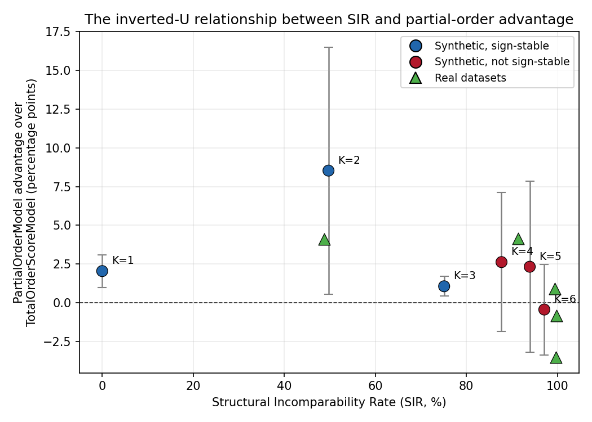

# gnn-poset-rank: Diagnostic and Predictive Tools for Poset-Aware Graph Neural Ranking

[](https://github.com/[username]/gnn-poset-rank/actions/workflows/tests.yml)
[](pyproject.toml)
[](LICENSE)

Official implementation and reproduction package for **"When Do Graph Neural
Rankers Need Partial Orders? A Diagnostic and Predictive Framework for
Poset-Aware Ranking."**



Graph neural network approaches to ranking and pairwise comparison recovery
(most notably GNNRank) almost universally reduce a collection of items to a
single global scalar score -- a total order. Real comparison data, however,
is frequently and genuinely partial: two items can be structurally
incomparable given the available evidence, not merely tied or unranked. This
repository provides:

1. A **three-metric diagnostic framework** (Cycle Inconsistency Rate,
   Transitive Redundancy Rate, and Structural Incomparability Rate) for
   auditing how totally-orderable a comparison dataset is, computed directly
   from data before any ranking model is fit.
2. Two graph neural architectures sharing an identical directed dual-stream
   encoder -- a total-order (single-score) baseline in the GNNRank lineage,
   and a partial-order-aware model that predicts dominance/incomparability
   directly -- letting the effect of the prediction head be isolated from
   any difference in encoder capacity.
3. Every experiment from the paper, reproducible from a single command per
   table: a systematic synthetic study relating Structural Incomparability
   Rate to the partial-order model's advantage, real-world validation
   across seven datasets in four domains, and a controlled synthetic study
   of feature informativeness as a secondary predictive factor.

- [Overview](#overview)
- [Getting Started](#getting-started)
  - [Setting Up the Environment](#setting-up-the-environment)
  - [Installing the Package](#installing-the-package)
  - [Code Structure](#code-structure)
- [Downloading Data](#downloading-data)
- [Running Experiments](#running-experiments)
  - [Table 1: Cross-Domain Audit](#table-1-cross-domain-audit)
  - [Table 2: Synthetic K-Scan](#table-2-synthetic-k-scan)
  - [Table 3: Real Graph Datasets](#table-3-real-graph-datasets)
  - [Tables 4, 4a, 5: NBA and HOUSE Skyline Datasets](#tables-4-4a-5-nba-and-house-skyline-datasets)
  - [Table 6: Feature Informativeness](#table-6-feature-informativeness)
  - [Section 5.5: MQ2008](#section-55-mq2008)
- [Reproducibility](#reproducibility)
- [Testing](#testing)
- [Interactive Notebook](#interactive-notebook)
- [Citation](#citation)
- [License](#license)
- [Contact](#contact)

## Overview

The central diagnostic quantity introduced by this work is the **Structural
Incomparability Rate (SIR)**: of all possible ordered item pairs, the
fraction with no directed path between them in either direction in the full
transitive closure of the cleaned comparison graph. SIR measures precisely
the fraction of a relation that a single global score is structurally unable
to represent, since a real-valued score necessarily places every pair of
items into a definite relative order.

We show, through a systematic synthetic study with confidence intervals and
matching multi-seed resampling protocols on seven real datasets across four
domains, that SIR predicts -- in a specific, verified inverted-U relationship
-- when a partial-order-aware GNN ranker outperforms a total-order baseline:
a robust, sign-stable advantage at moderate incomparability (SIR &asymp; 50%),
and a smaller, seed-unstable advantage at high incomparability (SIR &gt; 90%,
which describes every real graph-structured dataset audited in this work). A
controlled follow-up study identifies feature informativeness as a
complementary secondary factor explaining effect size once SIR has
identified a favorable regime.

Every quantitative claim in the paper is reproducible from this repository,
each backed by an automated test verifying it against known-correct values
(brute-force ground truth for the diagnostic framework; exact seed-by-seed
matches to the paper's reported tables for every experiment).

## Getting Started

### Setting Up the Environment

The project targets Python 3.9+. We recommend a virtual environment:

```bash
python -m venv .venv
source .venv/bin/activate  # on Windows: .venv\Scripts\activate
```

### Installing the Package

```bash
git clone https://github.com/arnauldmwafise/gnn-poset-rank.git
cd gnn-poset-rank
pip install -e .
pip install -r requirements.txt
```

Installing with `-e` (editable mode) makes the `gnn_poset_rank` package
importable from anywhere while keeping it linked to this source tree, and
is what the test suite and scripts assume.

### Code Structure

```
gnn_poset_rank/
├── diagnostics/
│   ├── cleaning.py            # generic FAS + transitive reduction pipeline
│   └── order_diagnostics.py   # CIR / TRR / SIR computation
├── data/
│   ├── citation.py            # Cora, CiteSeer loader
│   ├── chameleon.py           # Chameleon (Wikipedia hyperlinks) loader
│   ├── amazon.py              # Amazon0302 co-purchase network loader
│   ├── letor.py                # MQ2008 (LETOR 4.0) loader
│   ├── skyline.py              # NBA / HOUSE skyline benchmark loader
│   └── synthetic.py            # synthetic Pareto-dominance generator
├── models/
│   ├── encoders.py             # DirectedOrderConv, SharedEncoder (dual-stream)
│   └── heads.py                # TotalOrderScoreModel, PartialOrderModel
├── training/
│   └── train.py                 # sample_stratified_pairs, train_and_eval
└── experiments/
    ├── k_scan.py                            # Table 2
    ├── real_data_eval.py                    # Table 3
    ├── skyline_eval.py                      # Tables 4, 4a, 5
    ├── feature_informativeness.py           # Table 6
    └── mq2008_eval.py                       # Section 5.5

scripts/            # one runnable script per table, see below
tests/               # pytest suite, one file per subpackage
notebooks/          # a self-contained Colab-compatible reproduction notebook
```

Every public function and class has a full NumPy-style docstring describing
its parameters, return values, and -- where relevant -- the specific
methodological reasoning behind it (for example, why SIR is estimated via
Monte Carlo sampling above a fixed graph-size threshold, or why the training
leakage-prevention discipline in `real_data_eval.py` splits cover edges
before message passing rather than after).

## Downloading Data

```bash
python scripts/download_data.py --data-dir data
```

Downloads Cora, CiteSeer, Chameleon, Amazon0302, and the NBA/HOUSE skyline
benchmarks directly from verified, genuinely-directed source mirrors (see
each loader's module docstring in `gnn_poset_rank/data/` for why the specific
source matters -- several popular mirrors of these datasets are silently
symmetrized and unsuitable for this work).

**MQ2008 (LETOR 4.0) is not downloaded automatically**: Microsoft
Research's project page does not offer a single stable,
automation-friendly direct-download URL. Download `MQ2008.rar` (or a
maintained mirror) manually, extract it, and point `scripts/run_mq2008.py`
at the resulting `Fold1` directory.

## Running Experiments

Every script accepts `--seeds` to control which random seeds are run (fewer
seeds gives a faster smoke test at the cost of confidence-interval
precision) and prints a table directly comparable to the corresponding
table in the paper.

### Table 1: Cross-Domain Audit

```bash
python scripts/run_table1_audit.py --data-dir data
```

### Table 2: Synthetic K-Scan

```bash
python scripts/run_table2_kscan.py
# quicker smoke test:
python scripts/run_table2_kscan.py --k-values 1 2 --seeds 0 1
```

### Table 3: Real Graph Datasets

```bash
python scripts/run_table3_real_data.py --data-dir data
```

Amazon0302's full graph (262,111 nodes) is downsampled to an 8,000-node
connected subgraph via breadth-first search (`--amazon-subgraph-size` to
change this); Chameleon and the two citation networks run at full size.

### Tables 4, 4a, 5: NBA and HOUSE Skyline Datasets

```bash
python scripts/run_tables4_5_skyline.py --data-dir data
```

Searches all `C(8, 2) = 28` (NBA) and `C(6, 2) = 15` (HOUSE) dimension
pairs for the one closest to the target Structural Incomparability Rate
before running the model comparison -- this search is the slowest part of
the pipeline (roughly two minutes for HOUSE, given its 127,931 rows), not
the model training itself.

### Table 6: Feature Informativeness

```bash
python scripts/run_table6_informativeness.py
```

### Section 5.5: MQ2008

```bash
python scripts/run_mq2008.py --fold-dir data/MQ2008/Fold1
```

Requires the manual MQ2008 download described above.

## Reproducibility

Every number reported in the paper was independently re-verified against
this refactored codebase before release, not merely carried over from
earlier prototype scripts. This process caught one real regression worth
noting explicitly: the skyline dataset construction (`gnn_poset_rank/data/skyline.py`)
initially used NumPy's modern `Generator` API (`np.random.default_rng`)
where the original experiment code used the legacy global-state
`np.random.seed` / `np.random.choice` API -- these produce *different*
random streams even at the "same" seed value. Fixed to match the legacy API
exactly, so that running the provided scripts with the documented seeds
reproduces the paper's reported numbers seed-for-seed, not merely in
distribution.

Random seeds control three independent sources of variance throughout this
codebase -- the data split/sample, the pair sampling, and the model weight
initialization -- and a multi-seed protocol (`--seeds 0 1 2 3 4` throughout)
varies all three together, per the paper's stated resampling methodology.

## Testing

```bash
pytest tests/ -v
```

38 tests across the diagnostic framework, the two model architectures, the
synthetic data generator, and the shared training utilities, including a
brute-force ground-truth check for Structural Incomparability Rate (the
same check performed by hand before trusting the diagnostic tool on any
real dataset in the paper) and a direct regression guard against model
initialization silently ignoring its seed argument.

## Interactive Notebook

`notebooks/poset_ranking_reproducibility.ipynb` is a self-contained,
Colab-compatible notebook reproducing every table in the paper except
Section 5.5 (which requires the manual MQ2008 download described above),
for readers who prefer an interactive walkthrough over the command-line
scripts.

## Citation

If you use this code, please cite:

```bibtex
@misc{gnnposetrank2026,
    title={When Do Graph Neural Rankers Need Partial Orders? A Diagnostic and Predictive Framework for Poset-Aware Ranking},
    author={[Author Name]},
    year={2026},
    note={Code: https://github.com/[username]/gnn-poset-rank}
}
```

This work builds on and directly compares against GNNRank (He et al., 2022)
and the directed dual-stream message-passing design of Dir-GNN (Rossi et
al., 2024); see the paper's Related Work section for the complete
literature positioning.

## License

MIT -- see [LICENSE](LICENSE).

## Contact

If you have any questions, issues, or feedback, please open a GitHub issue,
or reach out to [Author Name] at `[email@institution.edu]`.
